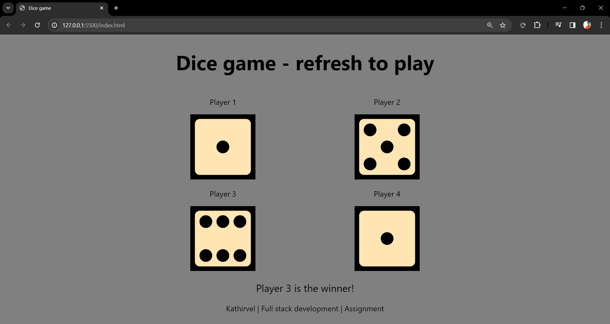

# Simple-Dice-Game

This is a simple dice game project implemented in HTML, CSS, and JavaScript. The game involves four players, each rolling a six-sided die, and determines the winner based on the highest rolled number.

## How to Play

1. Open `index.html` in a web browser.
2. Players' dice rolls will be displayed on the screen.
3. The winner or tie result will be shown below the dice.

## Project Structure

- `index.html`: HTML file for the game interface.
- `styles.css`: CSS file for styling the game interface.
- `script.js`: JavaScript file for the game logic and dice rolling.

## Screenshots




## Installation

Clone the repository:

```bash
https://github.com/kathirvelrajmohan/Simple-Dice-Game.git
```

Open the folder 

```bash
cd Simple-Dice-Game
```

Open index.html in a web browser to play the game.


